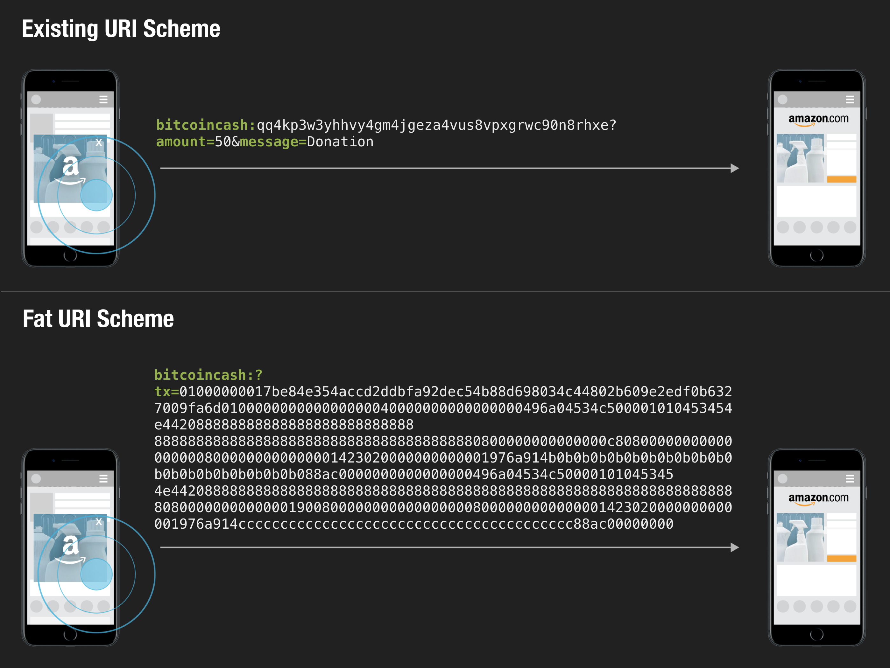
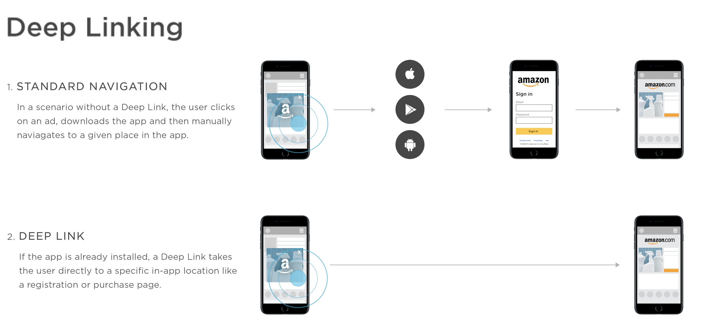

# Abstract



A simple extension to bitcoin's existing URI scheme. An additional "tx" parameter is introduced, which encodes the **full raw transaction hex string** instead of using the existing basic parameters such as "amount" or "message".

This proposal also discusses how this can drastically improve user experience, security, censorship resistance, and adoption of bitcoin wallets and decentralized applications, while spreading out risk and liability for every actor in the ecosystem.

# Background

Bitcoin has a cross-platform URI scheme standard (as specified by [BIP20](https://github.com/bitcoin/bips/blob/master/bip-0020.mediawiki) and [BIP21](https://github.com/bitcoin/bips/blob/master/bip-0021.mediawiki)) which lets multiple devices and applications easily communicate with one another by passing around pre-defined metadata as URI parameter. The most basic and well-known example is the bitcoin address itself:

```
bitcoincash:qq4kp3w3yhhvy4gm4jgeza4vus8vpxgrwc90n8rhxe
```

Because it's a standardized URI format, it can be:

- Included in a website as a link which when clicked opens a payment UI of the user's wallet app.
- Shared as a link through SMS, email, messaging apps, and social media.
- Encoded as a QR code image, which mobile wallets can scan to open the corresponding payment UI
- Sent over as NFC, bluetooth, and many other means.

The URI scheme spec also supports a handful of other parameters such as **"amount"** (to specify the amount of fund to request), and **"message"** (used to attach a simple OP_RETURN memo to the transaction). Here's an example:

```
bitcoincash:qq4kp3w3yhhvy4gm4jgeza4vus8vpxgrwc90n8rhxe?amount=50&message=Donation
```

While these basic properties have been useful, they are limited because they are only as powerful as the types of properties specified in the standard, therefore cannot support complex transactions which we will see more and more as more decentralized applications are built on top of Bitcoin.

# Motivation

As explained above, the existing Bitcoin URI scheme is good for serializing simple transactions (Example: Alice sends 1 bitcoin to Mad Hatter) but cannot support more complex transactions like: 

1. Programmable transactions (Multisig, Timelock, etc.)
2. Multi push data OP_RETURN transactions for building decentralized applications (Social Network, Messaging, Tokens, etc.)
3. Pre-signed transactions

What is needed is a simple open standard that can express ALL possible Bitcoin transactions with minimal change to the existing URI scheme. It should be fully backwards compatible and as easy and risk-free as possible for wallets, application developers, and merchants to implement.

# Specification

The proposal is simple. In addition to the existing URI scheme at [BIP21](https://github.com/bitcoin/bips/blob/master/bip-0021.mediawiki), we add another parameter called "tx", which represents the full raw transaction hex string. This proposal is chain agnostic and can be applied to any cryptocurrency, so for the sake of completeness I will mention both Bitcoin and Bitcoin Cash:

## Bitcoin

```
bitcoin:?tx=[RAW TRANSACTION HEX]
```

## Bitcoin Cash

```
bitcoincash:?tx=[RAW TRANSACTION HEX]
```

The protocol works like this: Whenever a wallet encounters a **tx** parameter in a URI scheme, it can deserialize the tx parameter to display the transaction object detail in a user-friendly manner, as well as give an option to the user to approve or decline the transaction. With just this simple addition, 

1. Wallets can support all kinds of powerful bitcoin transactions with minimal integration work (Just need to implement the display UI and don't have to worry about the UI for constructing various types of transactions)
2. Wallet developers can selectively implement the URI scheme spec by choosing the types of transactions they will display and broadcast after deserializing the transaction, which means it's completely opt-in based, easy, and risk-free to implement.
3. Because the tx parameter alone covers 100% of all Bitcoin transaction types, it eliminates any future need for introducing additional parameters which will bloat up the URL scheme.
4. Wallets are no longer just a payment method, but an authentication system, and as a result will give more power to the people.


# Use Cases

## 1. Programmable Transactions (Multisig, Timelock, etc.)

Most people don't use complex transactions such as multisig on a daily basis. There are many reasons for this, but one important reason is that there simply aren't many wallets that support these transactions, and rightfully so. The top priority for wallet developers should be to keep their user interface as simple as possible to ensure security and intuitive experience for their users, and these complex transactions are risky to implement.
With the Fat Transaction URI Scheme, the wallet doesn't need to implement a UI for constructing these transactions--they come pre-constructed from 3rd party--they only need to display the deserialized transactions to let users know what kind of transaction they're about to send, and then let them approve or decline the broadcast.

## 2. Signed Transactions

The existing URI scheme can only express unsigned transactions, but when you can send the entire raw transaction, it becomes possible to pass around already signed transactions. There are many potential applications for this, including censorship resistant payment, programmable contracts, and more cases people haven't yet thought of.

## 3. OP_RETURN powered decentralized applications

In the past, OP_RETURN has been used mostly for very primitive use cases such as leaving a simple note for a transaction. However as Bitcoin has evolved we are seeing more overlay protocols on top of Bitcoin that makes more heavy use of OP_RETURNs, and most of them require multiple push data instead of one.

- Social Media: OP_RETURN based social media protocols require not only one push data but multiple in order to express their application level protocol.
- Tokens: Token protocols make use of a sequence of multiple OP_RETURN push data to describe their application protocol, such as GENESIS, MINT, and SEND, followed by token_id and amount, etc. These protocols also require multiple push data.
- Database: It is possible to make sense of all these OP_RETURN data by turning them into [a queryable database](https://bitdb.network), which turns multiple OP_RETURN push data into database collection attributes.

# Example Scenarios

Here are a couple of basic scenarios that become possible with the new tx parameter:

## 1. Mobile: Decentralized Application

Mobile wallets can be used as an authentication system. Here's how:

1. User lands on a Bitcoin OP_RETURN powered decentralized application (a publishing app, for example) while browsing on a mobile device
2. Normally the only way to use the website would be to create an account through the website (to store the key and broadcast transactions through the application provider's server), but with Fat URI Scheme, this is not necessary.
3. Instead of going through any signup or login process, the users are immediately presented with a textarea. The user writes a post and presses "Submit" button. The web application dynamically constructs the corresponding unsigned OP_RETURN bitcoin transaction and triggers a URI open event through JavaScript (window.location.href="bitcoincash:?tx=01000000017be84e354accd2ddbfa92dec54b88d698034c44802b609e2edf0b6327009fa6d010000000000000000040000000000000000496a04534c500001010453454e442088888888888888888888888888    888888888888888888888888888888888888880800000000000000c808000000000000000008000000000000001423020000000000001976a914b0b0b0b0b0b0b0b0b0b0b0b0b0b0b0b0b0b0b0b088ac0000000000000000496a04534c50000101045345    4e4420888888888888888888888888888888888888888888888888888888888888888808000000000000019008000000000000000008000000000000001423020000000000001976a914cccccccccccccccccccccccccccccccccccccccc88ac00000000")
4. Above JavaScript command automatically opens the user's mobile bitcoin wallet app. The wallet displays the transaction details (The only thing the wallet app needs to implement is the ability to deserialize and display the raw transaction string to the user) and gives the user the option to approve or decline.
5. When the user approves, the wallet app signs the transaction with the user's private key and broadcasts to the network. Note that the broadcast is done by the user's own wallet instead of the web app's server. No key was exposed to the browser nor to the website's server in any way. In fact, the website doesn't even have the ability to track the user because even the transaction broadcast itself was executed from the user's own wallet and not through the browser. This will make decentralized applications truly censorship resistant.

## 2. Desktop: Decentralized Token Exchange

Here's an example of how a user would interact with a decentralized token exchange website on a desktop environment.

1. User lands on a token exchange website while browsing on a desktop
2. The website works like an ordinary token exchange website, but the difference is there is NO account system.
3. Instead, whenever the user wants to make a transaction and presses a "buy" or "sell" button, it dynamically creates an unsigned autonomous contract transaction and encodes it into a Fat URI scheme: bitcoincash:?tx=01000000017be84e354accd2ddbfa92dec54b88d698034c44802b609e2edf0b6327009fa6d010000000000000000040000000000000000496a04534c500001010453454e442088888888888888888888888888    888888888888888888888888888888888888880800000000000000c808000000000000000008000000000000001423020000000000001976a914b0b0b0b0b0b0b0b0b0b0b0b0b0b0b0b0b0b0b0b088ac0000000000000000496a04534c50000101045345    4e4420888888888888888888888888888888888888888888888888888888888888888808000000000000019008000000000000000008000000000000001423020000000000001976a914cccccccccccccccccccccccccccccccccccccccc88ac00000000
4. The user clicks the "Buy" or "Sell" button and it opens the desktop bitcoin wallet app, sending the entire transaction detail to the wallet. (For total security it's best if the wallet and the browser are separate, but it is also possible for the wallet developer to include a browser within the wallet, or vice versa, as long as the transaction part is sandboxed securely)
5. The desktop wallet deserializes the transaction and displays the details
6. The user approves or declines
7. If the user approves, the app signs the transaction and broadcasts to the network. The contract will be executed when the relevant conditions are met. No account was necessary. No centralized point of failure.

## 3. Cross-Device: Point of Service, QR Code, Bluetooth, Steganography, etc.

In many cases, users need to use their mobile wallet to transact with a 3rd party device. Even in these cases we can easily incorporate complex transaction types through Fat URI scheme.

1. A user buys a product at an offline store. The offline store has a Point of Service system that implements QR code, bluetooth, account system, or any other useful tarnsmission schemes. From here on we'll just use the QR code example since it's most widely understood.
2. Imagine the seller wants to accept bitcoin transactions but also use on-chain tokens or facilitate more sophisticated trasactions such as loyalty points, scheduled payments, or atomic swaps. This is currently impossible with the existing URI scheme.
3. Using the fat URI scheme, the seller's device can generate a complex transaction and encode the URI into a QR code: bitcoincash:?tx=01000000017be84e354accd2ddbfa92dec54b88d698034c44802b609e2edf0b6327009fa6d010000000000000000040000000000000000496a04534c500001010453454e442088888888888888888888888888    888888888888888888888888888888888888880800000000000000c808000000000000000008000000000000001423020000000000001976a914b0b0b0b0b0b0b0b0b0b0b0b0b0b0b0b0b0b0b0b088ac0000000000000000496a04534c50000101045345    4e4420888888888888888888888888888888888888888888888888888888888888888808000000000000019008000000000000000008000000000000001423020000000000001976a914cccccccccccccccccccccccccccccccccccccccc88ac00000000
4. User scans the QR code with the mobile wallet app
5. The mobile app deserializes the transaction and displays the details
6. The user approves or declines
7. When the user approves, the app signs the transaction and broadcasts to the network.

# Implementation Example: Deep Linking

There can be various ways to implement this scheme without disrupting user experience, but the most straight-forward approach would be to use the [deep linking](https://en.wikipedia.org/wiki/Deep_linking) approach.



Instead of having to implement a new UI (a tab, a new menu item, or new buttons) just for every new niche transaction type, wallet developers can simply implement a single page (view) that takes users straight to the relevant view, after interpreting the incoming raw transaction via fat URI scheme.

This means the wallet developers can start adding various implementations on their own terms, and with minimal risk. Most users won't even realize this special transaction page exists, only the ones who explicitly landed on the app through the fat URI scheme do.

# Signficance 

## 1. Wallets become more powerful

Wallet developers can easily support sophisticated transactions with minimal risk, instantly widening their use cases (therefore user base). Wallet providers don't need to worry about implementing user interface for constructing every possible complex transaction type, yet still easily integrate complex transaction types simply by implementing the parser that displays the transaction content.

Since the responsibility of transaction construction lies with 3rd party application developers, the wallet developer only needs to worry about correctly displaying the content so users can make the right decision whether to broadcast the transaction or not. 

By implementing the Fat URI Scheme, the wallets instantly gain the ability to allow their users to interact with any decentralized applications built on top of bitcoin, including the OP_RETURN protocols as well as programmable contract protocols. No need to worry about implementing complicated UI for constructing transactions for each and every protocol that gets launched. The only thing they need to implement is the feature to display transaction details in an intuitive manner.

## 2. Less liability and more usage for application developers

The biggest headache for application developers who build on top of Bitcoin is key management. Most wallets currently only support basic transaction types such as **Pay to PubKey Hash** in order to avoid complexity and risks. This means it's impossible to use these wallets to interact with decentralized applications that make more sophisticated types of transactions such as multisig, multi-push-data OP_RETURN, timelock, etc. As a result, the developers who work on these decentralized applications have to resort to implementing their own authentication systems that store encrypted keys either on their server or on the browser, neither of which are perfect solutions because of the compromise in security. 

1. Storing the encrypted keys on the server is risky because the server becomes the single point of failure.
2. Storing the encrypted keys on the browser doesn't have above risk but is vulnerable to web-based script attacks
3. Storing the encrypted keys inside a browser extension is also risky because all browser extensions must go through the "app store" approval process by the browser vendors and can be shut down instantly (Google Chrome can ban the extension, for example) which means it's not censorship resistant. Also, as long as these take place in the browser we cannot be completely confident about the security as they are vulnerable to the same type of web-based script attacks from item 2.

Overall, one could argue that storing private keys in anywhere but a dedicated standalone bitcoin wallet is fundamentally insecure. In a sense, the key management is the only single point of failure in this otherwise perfectly decentralized and secure system that is Bitcoin.

Bitcoin Fat URI scheme solves this problem by giving wallets the ability to process 100% of all possible bitcoin transactions, so the decentralized application developers don't need to worry about authentication.

## 3. More secure for every party involved

Currently, because there isn't a robust way for applications and wallets to communicate with each other in a flexible manner we are left with ad-hoc solutions that bring good to nobody.

1. App developers have to deal with the liability of managing their user's private keys securely, either on their server or in the user's browser.
2. Wallet providers must risk introducing risks if they want to implement all kinds of  complex transaction types which can be powerful yet experimental. 
3. As a result, users end up with fundamentally insecure authentication schemes.

By employing the fat transaction URI scheme, we can solve these problems more effectively.

## 4. More interoperability => Exponential network effect

When various heterogeneous actors (devices and applications) can interoperate with one another by passing around **fully self-contained bitcoin transactions** instead of just simple parameters, this will lead to a truly open "Internet of bitcoin". And just like all open and interoperable systems, this will lead to exponential network effect, which is great for everyone involved.

# Conclusion

The existing URI scheme for Bitcoin lacks expressiveness therefore the wallets can only do limited number of things. We want a completely open approach to tackling this problem. The crux of this proposal is to unbundle the concept of "sending a transaction" into multiple independent steps:

1. Compose
2. Sign
3. Broadcast

Then it becomes possible to let multiple heterogeneous parties handle what they're each best at and spread out risk and liability, which also brings security and decentralization. And most importantly much better user experience.
